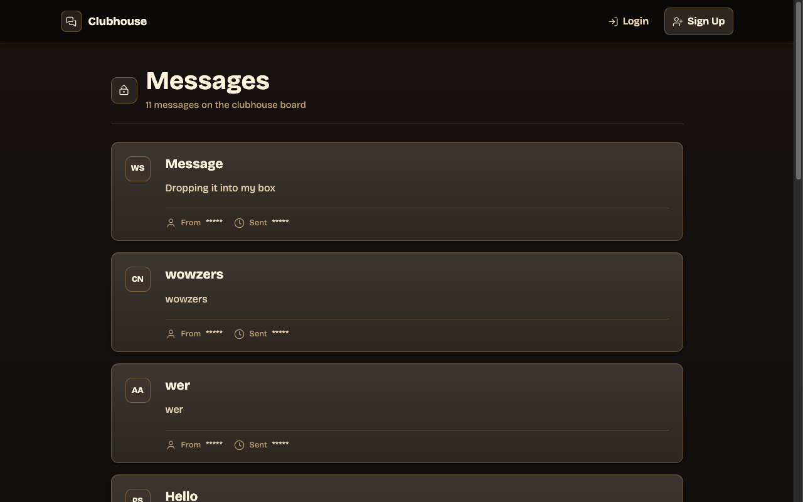

# Members Only

An exclusive "clubhouse" message board where members write **anonymous** posts — built to
practice **authentication and authorization**. Anyone can read posts, but only logged-in
members see who wrote them, and admins can delete messages.

## Preview



## Features

- User sign-up and login with **Passport** (local strategy) and **bcrypt** password
  hashing.
- Membership tiers gated by passcode (member/admin), changing what each user can see/do.
- Anonymous-looking posts whose authors are only revealed to members.
- Admin-only message deletion.
- PostgreSQL-backed users and messages, with `connect-pg-simple` session storage.

## Tech stack

Node.js · **Express** · **Passport** / `passport-local` · `bcryptjs` ·
**PostgreSQL** (`pg`) · `express-session` + `connect-pg-simple` · EJS · Tailwind CSS

## Getting started

```bash
npm install
npm run db:init      # initialize the database schema
npm run dev          # Express server + Tailwind watch (concurrently)
```

### Environment variables

Set in a local `.env` (gitignored). Variable **names** only:

| Variable | Used for |
|---|---|
| `POSTGRES_URL` | PostgreSQL connection string |
| `SESSION_PASS` | Session secret |
| `MEMBER_PASS` | Passcode to upgrade a user to member |
| `ADMIN_PASS` | Passcode to upgrade a user to admin |
| `SEED_PASS` | Password used when seeding test data |
| `PORT` | Server port (optional) |

## What I practiced

The full **auth lifecycle**: hashing passwords, session-based login with Passport,
role-based authorization (what members vs. admins can see/do), and persisting sessions
in Postgres.

## License

Odin Project coursework — original implementation by Aziz Umarov.
